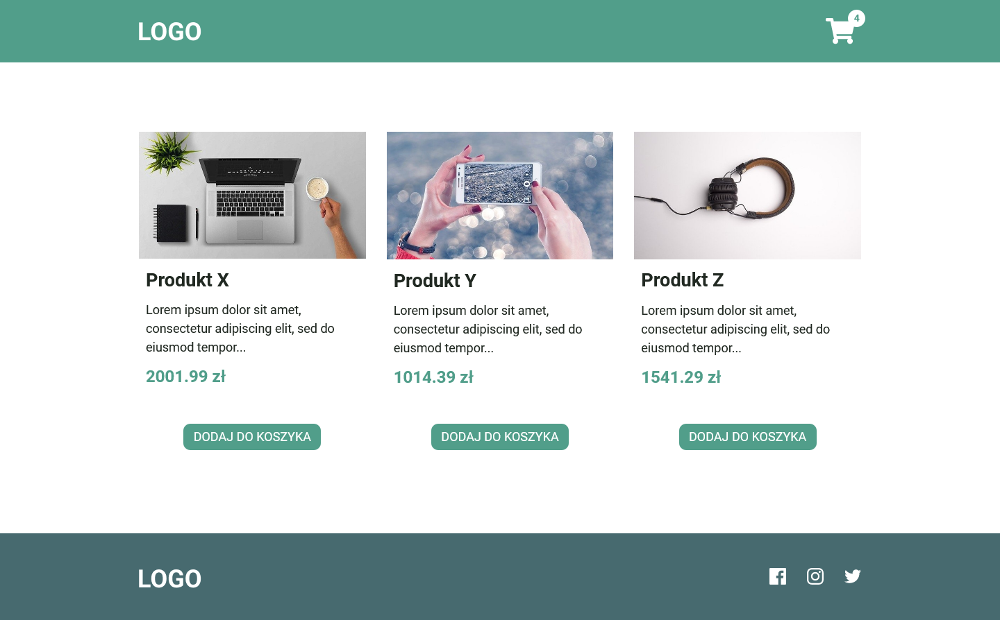
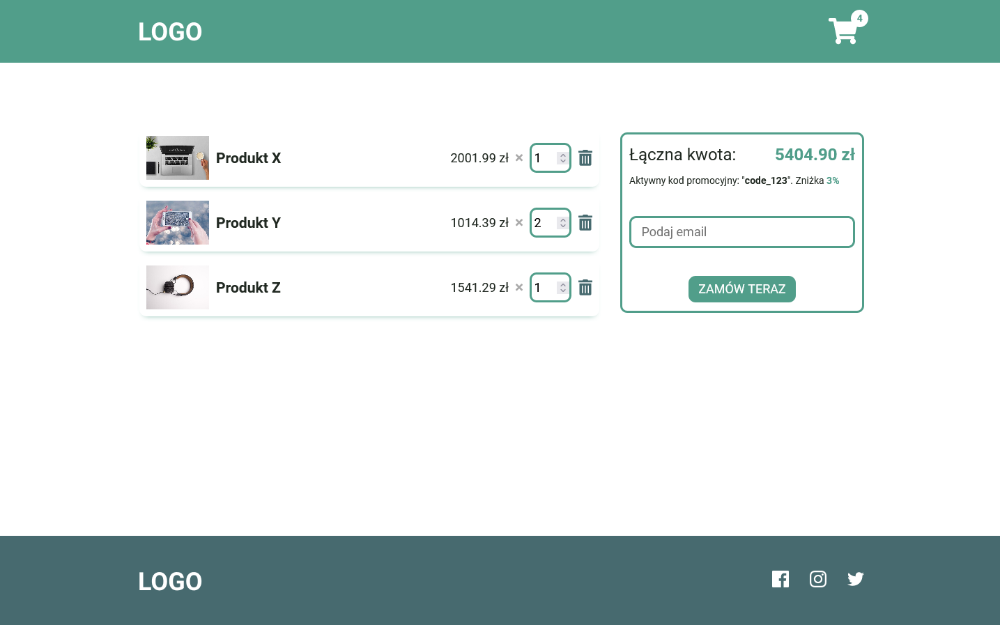

# Simple Shop App

This simple app is my solution to a task given to me as a part of the recruitment process.

## Table of contents

- [Overview](#overview)
  - [The task](#the-task)
  - [Screenshot](#screenshot)
  - [Links](#links)
- [My process](#my-process)
  - [Built with](#built-with)
  - [What I learned](#what-i-learned)
- [Author](#author)

## Overview

### The task

The task was to make a simple shop app. Requirements:

- App shows a list of products
- User can choose a product, and order it
- Order can be processed after the user provides an email address
- User can provide an optional promo code
- Promo code is valid, if it contains 2-8 digits, eg. code_123
- Discount is equal to the number of digits in code, eg. code_123 gives the user 3% discount

### Screenshot

### Links

- GitHub Repository URL: [https://github.com/OskarGrzelak/react-demo-shop-app](https://github.com/OskarGrzelak/react-demo-shop-app)
- Live Site URL: [https://oskargrzelak.github.io/react-demo-shop-app/](https://oskargrzelak.github.io/react-demo-shop-app/)

## My process

### Built with

- [React](https://reactjs.org/)
- [Figma](https://figma.com/)

### What I learned

The greatest challenge here has been coding a shopping cart with a working promo codes mechanism. I am pretty sure I have managed to do it well. On top of that, I have decided it will be a good opportunity to prove my designer's skill. I have prepared the design using Figma.

## Author

- Website - [Oskar Grzelak](http://www.oskargrzelak.pl)
- Github - [@OskarGrzelak](https://github.com/OskarGrzelak)